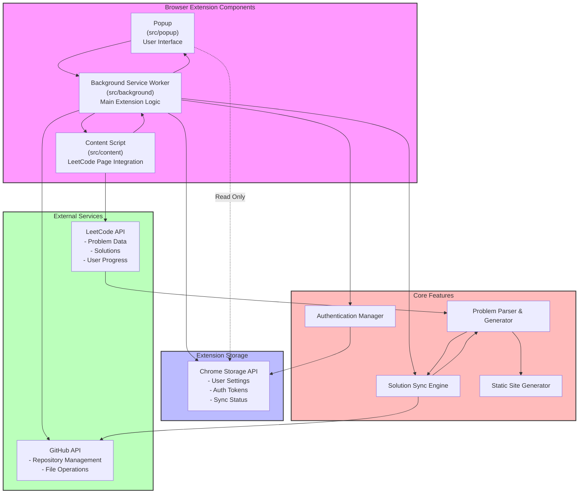

# LeetLoaf Oven (Browser Extension) Architecture

## Component Details

### Browser Extension Components

- **Popup**: User interface that appears when clicking the extension icon
- **Background Service Worker**: Core extension logic and coordination
- **Content Script**: Integrates with LeetCode pages

### Extension Storage

- Chrome Storage API for persisting:
  - User settings
  - Authentication tokens
  - Sync status

### External Services

- **LeetCode API**: Source of problems and solutions
- **GitHub API**: Repository and file management

### Core Features

- **Authentication Manager**: GitHub OAuth handling
- **Solution Sync Engine**: Orchestrates solution syncing
- **Problem Parser**: Processes LeetCode problems
- **Static Site Generator**: Creates browsable solution website

## Key Interactions

1. **User Interface Flow**
   - Popup communicates with background service worker
   - Background worker updates UI state

2. **Data Flow**
   - Content script monitors LeetCode pages
   - Parser formats problem data
   - Sync engine pushes to GitHub
   - Static site generator creates documentation

3. **Authentication Flow**
   - Auth manager handles GitHub OAuth
   - Tokens stored in Chrome Storage
   - Background worker manages auth state